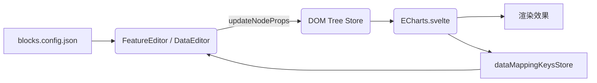

# ECharts 图表组件说明

> 本文档梳理了项目中 **ECharts** 图表区块从「元数据定义 → 编辑器面板 → 运行时渲染」的完整链路，便于后续二次开发与排错。

## 1. 元数据：`blocks.config.json`

| 字段 | 说明 |
| ---- | ---- |
| `featureProps` | 控制 **特性面板 (FeatureEditor)** 的表单项。当前包含 `designWidth/Height`、`renderer`、`code`、图表案例链接等。 |
| `dataSource`  | 控制 **数据面板 (DataEditor)** 的表单项。提供三种数据接入方式：`json / mock / real`，通过 `dataSource.dataAccess` 字段配置。|

依赖元数据的优势：

1. **零硬编码** – 面板 UI 100 % 由 JSON 决定；
2. **扩展简单** – 只需在此文件添加/修改字段即可同步到编辑器。

---

## 2. FeatureEditor – 特性面板

* 动态读取 `featureProps` 渲染行；
* 内置 `switch / select / number / size / image / code` 等输入类型的统一处理；
* 对 ECharts 特有逻辑：
  * 调整 `designWidth / designHeight` → 影响渲染组件的缩放；
  * 代码编辑框 `code`：存储 JS 配置片段；
  * `renderer`：Canvas / SVG 渲染器切换（通过开关控制）；
  * 图表案例链接：提供官方案例和社区案例的外部链接。

> 所有更改均通过 `updateNodeProps` 写回 **DOM Tree**。

---

## 3. DataEditor – 数据面板

### 3.1 数据源切换

* `dataSource.dataAccess` = `json`：直接编辑 `seriesData`（由代码中 `data: [...]` 自动解析提取）。
* `dataSource.dataAccess` = `mock`：填写接口路径 & 映射 `mockSeriesMapping` 字段。
* `dataSource.dataAccess` = `real`：填写真实请求路径 & 映射 `requestSeriesMapping` 字段。

> **注意**：配置中使用 `dataSource.dataAccess` 字段定义，但在组件代码中通过 `dataSource` 属性读取，并提供了兼容性处理：`currentValues.dataSource ?? dataSourceConfig?.default ?? 'json'`。在 DataEditor 中，优先使用节点属性中的 `dataSource` 值，如果没有则使用组件配置的默认值，最后回退到 `'json'`。

### 3.2 序列提取逻辑（series-extractor.service）

`extractSeriesFromCode(code, seriesData)` 负责将用户在代码编辑器中填写的 JS 字符串解析成可供表格渲染的“数组”格式，并返回三组信息：

1. `dataArrays`：解析后得到的二维数据（对应表格中每一行）
2. `matches`：正则匹配结果数组（`RegExpMatchArray[]`），用于反向写回代码
3. `legendData`：从代码中提取的 `legend.data` 数组

该函数内部会：

- 优先使用 **ECharts 实例中的 option**（如果实例存在且包含有效数据），构造“伪”`RegExpMatchArray`，保证实时预览时数据不丢失；
- 若实例不存在，则退而使用正则从 `code` 字符串中提取 `legend.data`、`xAxis.data` 及各 `series[i].data`；
- 提取 `legendData` 时，使用 `extractLegendData(code)` 正则解析 `legend.data = [...]` 语句；
- 在 `extractDataMatches` 函数中，当使用 ECharts 实例数据时，会**使用实例中的 legendData 更新原始 option 中的 series.name**，确保系列名称与图例数据同步；
- 最终返回统一结构，供 `DataEditor` 渲染表格及后续写回。

**重要更新**：当 ECharts 实例存在时，`extractDataMatches` 会使用实例中的 `legend.data` 来同步更新 `originalOption.series` 中的系列名称，解决系列名称与图例数据不同步的问题。

**DataEditor 中的序列计数修复**：
- **问题**：当切换数据源或刷新页面时，`seriesCount` 可能为 0，导致无法显示动态映射字段
- **原因**：`extractSeriesFromCode` 返回的 `matches` 数组为空，但 `seriesData` 实际有数据
- **解决方案**：在 `DataEditor.svelte` 的 `derivedState` 函数中添加多重保护机制：
  1. **无 code 情况**：当 `!code` 时，使用 `seriesData.length` 创建空的 `matches` 数组
  2. **缓存修复**：当使用缓存且 `matches.length === 0` 但 `seriesData` 有数据时，创建空的 `matches` 数组
  3. **解析修复**：当 `extractSeriesFromCode` 返回空 `matches` 但 `seriesData` 有数据时，创建空的 `matches` 数组
- **实现**：创建兼容的 `RegExpMatchArray` 对象，确保 `seriesCount = matches.length` 正确反映实际序列数量

**extractDataMatches 函数详解**（新实现）：
```typescript
export function extractDataMatches(code: string): RegExpMatchArray[] {
  // 优先使用 ECharts 实例中的真实数据
  const currentId = selectedId?.()
  let instanceSeriesData: any[] = []
  let instanceLegendData: any[] | undefined = undefined
  let instanceXAxisData: any[] | undefined = undefined

  if (currentId) {
    const chartInst = getEChartsInstance(currentId)
    if (chartInst && typeof chartInst.getOption === 'function') {
      try {
        const option = chartInst.getOption()
        // 提取 series、legend、xAxis 数据
        const series = (option?.series ?? []) as any[]
        instanceSeriesData = series.map((s: any) => s?.data).filter((d: any) => Array.isArray(d))

        const legend = option?.legend ?? {}
        if (Array.isArray(legend)) {
          instanceLegendData = legend[0]?.data ?? undefined
        } else if (legend && typeof legend === 'object') {
          instanceLegendData = (legend as any).data
        }

        const xAxis = option?.xAxis ?? {}
        if (Array.isArray(xAxis)) {
          instanceXAxisData = xAxis[0]?.data ?? undefined
        } else if (xAxis && typeof xAxis === 'object') {
          instanceXAxisData = (xAxis as any).data
        }
      } catch (err) {
        console.warn('[series-extractor] 读取 ECharts 实例 option 时失败', err)
      }
    }
  }

  // 将实例数据转换为伪 RegExpMatchArray，保持旧接口兼容
  const fakeMatches: RegExpMatchArray[] = []

  if (instanceLegendData && Array.isArray(instanceLegendData)) {
    const legendStr = JSON.stringify(instanceLegendData)
    fakeMatches.push([`legend.data: ${legendStr}`, legendStr] as unknown as RegExpMatchArray)
  }
  if (instanceXAxisData && Array.isArray(instanceXAxisData)) {
    const xAxisStr = JSON.stringify(instanceXAxisData)
    fakeMatches.push([`xAxis.data: ${xAxisStr}`, xAxisStr] as unknown as RegExpMatchArray)
  }
  // 再追加各 series.data
  instanceSeriesData.forEach((arr) => {
    const arrStr = JSON.stringify(arr)
    fakeMatches.push([`series.data: ${arrStr}`, arrStr] as unknown as RegExpMatchArray)
  })

  return fakeMatches
}
```
- **输入**：ECharts 配置代码字符串（备用）
- **输出**：从实例获取的真实数据，格式化为 RegExpMatchArray
- **核心逻辑**：实例数据优先 → 转换为兼容格式 → 返回有效数据

**使用场景**：
- 在 `DataEditor.svelte` 中用于计算序列数量：调用 `extractSeriesFromCode(code)` 后使用 `matches.length` 获取序列个数
- 在 `extractSeriesFromCode` 中用于提取数据：`const matches = extractDataMatches(code)`
- **优势**：使用真实运行时的数据，比正则提取更准确可靠

### 3.3 数据配置清理与缓存机制

当用户在 **FeatureEditor** 中清空 `code` 字段时，系统会自动清除所有相关的数据配置，包括：
- `seriesData`：序列数据
- `mockPath`：模拟数据接口路径
- `mockSeriesMapping`：模拟数据字段映射
- `requestPath`：真实数据接口路径
- `requestSeriesMapping`：真实数据字段映射

这种清理机制确保了当图表配置被重置时，不会残留无效的数据映射配置，保持数据一致性。该逻辑在 `FeatureEditor.svelte` 的 `handleAttrChange` 函数中实现，仅在用户手动修改 `code` 时触发（切换页签等操作不会触发清理）。

**新增缓存清除机制**：
- 当用户修改图例数据（`index === 0`）时，DataEditor 会自动清除解析缓存（`lastCode = undefined` 和 `lastExtraction = null`）
- 这确保下次解析时使用最新的代码内容，避免缓存导致系列名称同步问题
- 特别适用于图例数据更新后需要立即同步系列名称的场景

### 3.4 `第 X 序列 / 第 X 映射` 动态属性编辑流程

1. **序列数量计算**：DataEditor 调用 `extractSeriesFromCode(code)`，并以其 `matches.length` 作为序列个数（优先使用实例数据，回退到代码解析）。
   - **修复机制**：当 `matches` 为空但 `seriesData` 有数据时，系统会创建空的 `matches` 数组确保 `seriesCount` 正确
   - **多重保护**：在无 code、缓存命中、解析结果为空等情况下都会确保 `seriesCount` 反映真实序列数量
2. **渲染输入控件**：
   * 当 `dataSource === 'json'` 时，为每条序列渲染一个 `<CodeEditor>`，标题显示为「第一序列 / 第二序列 …」。
   * 当 `dataSource === 'mock'` 或 `real` 时，为每条序列渲染一个 `<PropertySelect>` 或输入框，标题显示为「第一映射 / 第二映射 …」。
     * `PropertySelect` 的下拉选项来源于全局 `dataMappingKeysStore`，该 store 在运行时由 `ECharts.svelte` 根据实际请求到的数据字段动态填充，确保可视化选择。store 实现采用简单的键值对结构，以节点 ID 为键，字段数组为值，提供 `setKeys`、`clearKeys`、`clearAll` 等方法进行状态管理。
3. **序列/映射数据来源**：
   * `seriesData`：来自 `extractSeriesFromCode` 对用户 JS 的解析结果，初次加载即写入节点属性；
   * `mockSeriesMapping` / `requestSeriesMapping`：初始为空，由用户在面板选择或输入后产生；

4. **实时回写**：用户修改后调用对应函数：
   * `updateDataArray(idx, value)` → 更新 `seriesData`；
   * `updateMockSeriesMapping(idx, path)` → 更新 `mockSeriesMapping`；
   * `updateRequestSeriesMapping(idx, path)` → 更新 `requestSeriesMapping`。
   这些函数均通过 `handleAttrChange(key, value)` 调用 `updateNodeProps()` 将新值写入节点 `attributes`。
5. **状态同步**：`updateNodeProps` 更新 **DOM Tree Store**，触发 `getNodePropsStore` 的订阅，DataEditor 与 `ECharts.svelte` 均会收到最新属性。
6. **图表刷新**：`ECharts.svelte` 在 `$derived(option)` 阶段根据最新 `seriesData` / 映射数组重新注入数据后执行 `chart.setOption()`，从而实现图表的实时更新。

**修复效果**：通过以上机制，解决了切换数据源或刷新页面时动态映射字段不显示的问题，确保在各种场景下都能正确显示「第 X 映射」输入框。

### 3.8 调试与错误处理

**日志输出增强**：
- **DataEditor**：增加详细的调试日志，记录图例数据更新、系列名称同步等关键操作
- **ECharts.svelte**：增加系列名称同步过程的调试输出，便于追踪问题
- **缓存清除日志**：记录缓存清除操作，确保调试时可追踪缓存机制的工作状态

**错误处理**：
- 当数据解析失败时，提供回退机制，确保图表能正常初始化
- 当映射配置不完整时，提供默认值和友好的错误提示
- 当网络请求失败时，显示加载错误状态，避免界面卡死

**关键调试信息**：
```
[DataEditor] derivedState 使用缓存，跳过解析
[DataEditor] derivedState 解析 code，得到 {dataArrays: [...], matches: [...]}
[DataEditor] seriesCount 更新为: 3, dataSource: json, code存在: true
[DataEditor] 图例数据已更新，将触发系列名称同步: ["Line 1","Line 2","Line 3"]
[DataEditor] updateNodeProps → id: chart1, key: seriesData, value: [...]
[ECharts] 使用更新后的legend数据同步系列名称: ["Line 1","Line 2","Line 3"]  
[ECharts] 系列 0 名称更新: "Lin1e 1" -> "Line 1"
[ECharts] option(after seriesData override): {title: {...}, legend: {...}, series: [...]}
```

**常见问题排查**：
1. **系列名称不同步**：检查控制台是否有上述调试日志，确认图例数据更新是否触发了系列名称同步
2. **缓存问题**：如果修改后数据未更新，查看是否有缓存清除相关的日志（如 `derivedState 解析 code` 表示缓存被清除并重新解析）
3. **解析失败**：检查代码格式是否正确，确认 `extractSeriesFromCode` 返回的数据结构
4. **防抖机制**：注意 `seriesCount` 的更新是有防抖的，只有当数量真正变化时才会更新和打印日志
5. **数据映射问题**：确保 `seriesData` 数组的顺序与代码中的数据顺序一致，特别是图例数据（索引 0）对应 `legend.data`

### 3.5 系列名称同步优化

**问题背景**：当用户更新图例数据（legend.data）时，系列名称（series.name）未能同步更新，导致图表显示异常。具体表现为：即使用户修正了图例数据中的拼写错误（如将 "Lin1e 1" 改为 "Line 1"），系列名称仍然保持旧值。

**根本原因**：`ECharts.svelte` 原本使用从代码字符串提取的 `legendData`（旧数据）来同步系列名称，而不是使用更新后的 `codeResult.legend.data`。

**解决方案**：
1. **使用更新后的 legend 数据**：在 `ECharts.svelte` 中，改用 `codeResult.legend.data`（更新后的数据）而不是 `legendData`（从代码提取的旧数据）来同步系列名称
2. **添加调试日志**：增加详细的调试输出，记录系列名称的变更过程
3. **DataEditor 缓存清除**：当图例数据更新时，自动清除解析缓存，确保下次使用最新数据

**代码实现**：
```ts
// ECharts.svelte - 使用更新后的legend数据同步系列名称
if (dataSource === 'json' && codeResult.legend && codeResult.legend.data && Array.isArray(codeResult.legend.data) && codeResult.series && Array.isArray(codeResult.series)) {
    codeResult.series.forEach((s: any, i: number) => {
        if (codeResult.legend.data[i]) {
            const oldName = s.name
            s.name = codeResult.legend.data[i]
            // 调试输出：记录系列名称的变更
            if (oldName !== s.name) {
                console.log(`[ECharts] 系列 ${i} 名称更新: "${oldName}" -> "${s.name}"`)
            }
        }
    })
}
```

```ts
// DataEditor.svelte - 图例数据更新时清除缓存
if (index === 0 && dataSource === 'json') {
    // 关键修复：清除缓存，强制重新解析代码以同步系列名称
    lastCode = undefined // 清除代码缓存，确保重新解析
    lastExtraction = null // 清除提取缓存
    console.log(`[DataEditor] 图例数据已更新，将触发系列名称同步: ${newValue}`)
}
```

**修复效果**：现在当用户更新图例数据时，系列名称会实时同步更新，解决了 "系列不存在" 的警告问题。

**缓存清理机制**：
`DataEditor.svelte` 中的缓存清理机制确保了：
1. 当图例数据被修改时，强制重新解析代码
2. 避免使用过期的缓存数据
3. 确保系列名称同步的及时性和准确性

这种双重保障机制（ECharts组件内的同步 + DataEditor组件内的缓存清理）确保了系列名称与图例数据的完美同步。

### 3.6 防抖优化机制

**问题背景**：
切换组件或数据源时，多个属性（`dataSource`、`seriesData`、`code`、映射配置等）会依次更新，导致 `[ECharts] option(after seriesData override)` 日志重复打印。

**解决方案**：
在 `ECharts.svelte` 中实现防抖机制，通过比较前后值，只在真正有变化时才打印日志：

```typescript
// 通过比较前后值，只在真正有变化时才打印日志
const codeResultStr = JSON.stringify(codeResult)
const lastOptionStr = JSON.stringify(lastOptionValue)
if (codeResultStr !== lastOptionStr) {
    console.log('[ECharts] option(after seriesData override):', codeResult)
    lastOptionValue = codeResult
}
```

**效果**：
- 避免了短时间内重复打印相同的 option 数据
- 让调试日志更加清晰，同时不影响功能
- **系列名称同步的防抖处理**：由于系列名称同步是在 `option` 计算过程中完成的，因此也受益于上述防抖机制。只有当数据真正发生变化时，才会触发系列名称的同步操作和相应的调试日志输出

**DataEditor 中的防抖优化**：
在 `DataEditor.svelte` 中也实现了防抖机制，避免 `seriesCount` 的频繁更新：

```typescript
let seriesCount = $state(0)
let lastSeriesCount = $state(0) // 用于防抖，记录上一次的seriesCount值
$effect(() => {
    const newSeriesCount = derivedStateResult.matches.length
    // 防抖机制：只有当seriesCount真正发生变化时才更新和打印日志
    if (newSeriesCount !== lastSeriesCount) {
        seriesCount = newSeriesCount
        lastSeriesCount = newSeriesCount
        console.log(`[DataEditor] seriesCount 更新为: ${seriesCount}, dataSource: ${dataSource}, code存在: ${!!currentValues.code}`)
    }
})
```

这种双重防抖机制确保了：
1. 减少不必要的计算和日志输出
2. 提高性能，特别是在频繁切换组件时
3. 保持调试信息的准确性和可读性

### 3.7 调试和错误处理

**调试日志**：在 `DataEditor.svelte` 中添加了详细的调试日志，帮助开发者追踪数据流：
```typescript
console.log('[DataEditor] derivedState 使用缓存，跳过解析')
console.log('[DataEditor] derivedState 解析 code，得到', extraction)
console.log(`[DataEditor] seriesCount 更新为: ${seriesCount}, dataSource: ${dataSource}, code存在: ${!!currentValues.code}`)
console.log(`[DataEditor] updateNodeProps → id: ${selectedId}, key: ${key}, value:`, value)
```

**错误处理**：
- **循环更新保护**：使用 `isUpdating` 标志防止 `seriesData` 回写时的循环更新
- **缓存机制**：通过 `lastCode` 和 `lastExtraction` 避免重复解析相同的代码
- **空值保护**：在所有可能为空的地方提供默认值，确保 UI 稳定性

---

## 4. 渲染组件：`ECharts.svelte`

核心职责：

| 模块 | 关键点 |
| ---- | ---- |
| 尺寸缩放 | 依据 `designWidth/Height` 或全局 store 计算 `scale`，在外层容器应用 `transform: scale()`，保证多分辨率自适应。 |
| 数据接入 | ① `json`：用 `seriesData` 替换代码里的 `data` 数组；② `mock/real`：调用 `cachedFetch` 拉取数据，并暴露字段到 `dataMappingKeysStore` 供面板下拉。 |
| 代码执行 | `executeJavaScriptCode` 在 **沙箱**（with + Function）中运行用户 JS，注入 `echarts.graphic` & `data` 等安全对象，返回最终 option。 |
| Option 生成 | 统一在 `$derived(option)` 中完成：loading / error / legendData 补齐 / data 替换 / 映射数据注入等。 |
| 渲染 | 当 `chartReady`（容器有尺寸）后渲染 `<Chart this={ECharts}>`。支持 `bind:ready` 事件获取实例。 |
| 错误处理 | 提供详细的错误提示和加载状态管理，包括代码执行错误和数据加载失败处理。

---

## 5. echarts-core.ts – 按需注册 & init 包装

```ts
import * as echarts from 'echarts/core';
import { BarChart, LineChart, PieChart } from 'echarts/charts';
// ...use GridComponent、TooltipComponent 等
import { CanvasRenderer, SVGRenderer } from 'echarts/renderers';

echarts.use([...components]);
export default function (dom, theme, opts) {
  return echarts.init(dom, theme, { useCoarsePointer: true, ...opts });
}
```

* 集中管理 **图表类型 / 组件 / 渲染器**；
* 增加图表类型 → 只需在此 `use()` 即可。

---

## 6. 数据流概览



---

## 7. 扩展指引

---

## 8. 图表初始化流程

1. **DOM 挂载**：`ECharts.svelte` 在 Svelte `onMount` 阶段将 `div.chart` 挂入文档，并通过 `<ECharts>` 组件的 `init` 回调执行 `echartsInit(dom, theme, opts)`（封装于 `echarts-core.ts`）。
2. **实例创建**：`echartsInit` 内部调用 `echarts.init(dom, theme, { renderer, useCoarsePointer: true, ...opts })` 获得 `chartInstance` 并返回。
3. **首次 setOption**：`svelte-echarts`（第三方库）监听 `options` prop 的初值，当检测到非空时立刻执行 `chartInstance.setOption(options, true)` 完成首渲。
4. **响应式更新**：后续只要 `options` 或 `theme/renderer` 等 prop 变化，该封装组件会再次执行 `setOption` 或 `chartInstance.dispose()+init`，从而保持图表与状态实时同步。
5. **尺寸监听**：`svelte-echarts` 默认监听父容器 ResizeObserver；在 `ECharts.svelte` 内也会根据缩放 `scale` 变化调用 `chart.resize()`，确保在编辑器缩放场景下不会出现错位。

这样即可实现「挂载→实例→首渲→更新→销毁」的完整生命周期管理，无需手动调用 `setOption()`。

---

## 9. 条件显示机制

配置支持 `showIf` 条件显示，可根据其他字段的值动态控制字段的显示/隐藏：

```json
{
  "showIf": {
    "key": "dataSource",      // 依赖的字段名（实际存储的是dataSource值）
    "value": "mock"          // 依赖字段的值
  }
}
```

---

## 10. 扩展指南

1. **添加面板字段**：在 `blocks.config.json` 的 `featureProps` 或 `dataSource` 添加条目即可；面板 UI 自动更新。
   - 支持字段类型：`switch / select / number / size / image / code / text / linkGroup`
   - 支持条件显示：`showIf` 机制
2. **支持新图表类型**：
   * 在 `echarts-core.ts` 引入并 `echarts.use()`；
   * 在示例 JS `code` 中按 ECharts 规则书写即可。
3. **自定义数据解析**：若标准 `seriesData` 替换无法满足，可修改 `extractSeriesFromCode` 实现更复杂解析逻辑。
4. **添加辅助链接**：通过 `linkGroup` 类型可添加外部链接，如图表案例和模拟平台链接。

---

> 如有疑问或改进建议，欢迎提 Issue 😉