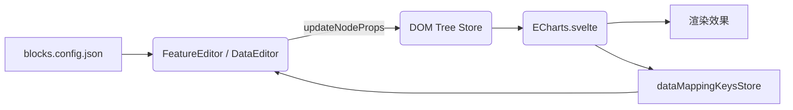

# ECharts 图表组件说明

> 本文档梳理了项目中 **ECharts** 图表区块从「元数据定义 → 编辑器面板 → 运行时渲染」的完整链路，便于后续二次开发与排错。

## 1. 元数据：`blocks.config.json`

| 字段 | 说明 |
| ---- | ---- |
| `featureProps` | 控制 **特性面板 (FeatureEditor)** 的表单项。当前包含 `designWidth/Height`、`renderer`、`code`、图表案例链接等。 |
| `dataSource`  | 控制 **数据面板 (DataEditor)** 的表单项。提供三种数据接入方式：`json / mock / real`，通过 `dataSource.dataAccess` 字段配置。|

依赖元数据的优势：

1. **零硬编码** – 面板 UI 100 % 由 JSON 决定；
2. **扩展简单** – 只需在此文件添加/修改字段即可同步到编辑器。

---

## 2. FeatureEditor – 特性面板

* 动态读取 `featureProps` 渲染行；
* 内置 `switch / select / number / size / image / code` 等输入类型的统一处理；
* 对 ECharts 特有逻辑：
  * 调整 `designWidth / designHeight` → 影响渲染组件的缩放；
  * 代码编辑框 `code`：存储 JS 配置片段；
  * `renderer`：Canvas / SVG 渲染器切换（通过开关控制）；
  * 图表案例链接：提供官方案例和社区案例的外部链接。

> 所有更改均通过 `updateNodeProps` 写回 **DOM Tree**。

---

## 3. DataEditor – 数据面板

### 3.1 数据源切换

* `dataSource.dataAccess` = `json`：直接编辑 `seriesData`（由代码中 `data: [...]` 自动解析提取）。
* `dataSource.dataAccess` = `mock`：填写接口路径 & 映射 `mockSeriesMapping` 字段。
* `dataSource.dataAccess` = `real`：填写真实请求路径 & 映射 `requestSeriesMapping` 字段。

> **注意**：配置中使用 `dataSource.dataAccess` 字段定义，但在组件代码中通过 `dataSource` 属性读取，并提供了兼容性处理：`currentValues.dataSource ?? dataSourceConfig?.default ?? 'json'`。在 DataEditor 中，优先使用节点属性中的 `dataSource` 值，如果没有则使用组件配置的默认值，最后回退到 `'json'`。

### 3.2 序列提取逻辑

通过 `series-extractor.service`：

1. **实例数据提取**（新实现）：优先从 ECharts 实例中获取实际数据，包括 series.data、legend.data、xAxis.data；
2. **数据提取** 使用 `extractDataMatches(code)` 函数，该函数：
   - **实例数据优先**：如果存在 ECharts 实例，直接读取 `chartInst.getOption()` 获取真实数据
   - **多类型数据支持**：提取 series.data、legend.data、xAxis.data 等不同类型的数据
   - **返回结果**：`RegExpMatchArray[]` 数组，保持与旧接口兼容
3. **legend 数据提取**：额外调用 `extractLegendData(code)` 提取 `legend.data` 配置用于图例显示
4. **数据解析**：将提取到的数据字符串通过 `JSON.parse` 或 `Function` 构造器解析为可用的数组格式
5. **结果整合**：返回包含 `dataArrays`（数据数组）、`matches`（匹配结果）、`legendData`（图例数据）的完整提取结果
6. **支持多序列、一键同步写回**；

**extractDataMatches 函数详解**（新实现）：
```typescript
export function extractDataMatches(code: string): RegExpMatchArray[] {
  // 优先使用 ECharts 实例中的真实数据
  const currentId = selectedId?.()
  let instanceSeriesData: any[] = []
  let instanceLegendData: any[] | undefined = undefined
  let instanceXAxisData: any[] | undefined = undefined

  if (currentId) {
    const chartInst = getEChartsInstance(currentId)
    if (chartInst && typeof chartInst.getOption === 'function') {
      try {
        const option = chartInst.getOption()
        // 提取 series、legend、xAxis 数据
        const series = (option?.series ?? []) as any[]
        instanceSeriesData = series.map((s: any) => s?.data).filter((d: any) => Array.isArray(d))

        const legend = option?.legend ?? {}
        if (Array.isArray(legend)) {
          instanceLegendData = legend[0]?.data ?? undefined
        } else if (legend && typeof legend === 'object') {
          instanceLegendData = (legend as any).data
        }

        const xAxis = option?.xAxis ?? {}
        if (Array.isArray(xAxis)) {
          instanceXAxisData = xAxis[0]?.data ?? undefined
        } else if (xAxis && typeof xAxis === 'object') {
          instanceXAxisData = (xAxis as any).data
        }
      } catch (err) {
        console.warn('[series-extractor] 读取 ECharts 实例 option 时失败', err)
      }
    }
  }

  // 将实例数据转换为伪 RegExpMatchArray，保持旧接口兼容
  const fakeMatches: RegExpMatchArray[] = []

  if (instanceLegendData && Array.isArray(instanceLegendData)) {
    const legendStr = JSON.stringify(instanceLegendData)
    fakeMatches.push([`legend.data: ${legendStr}`, legendStr] as unknown as RegExpMatchArray)
  }
  if (instanceXAxisData && Array.isArray(instanceXAxisData)) {
    const xAxisStr = JSON.stringify(instanceXAxisData)
    fakeMatches.push([`xAxis.data: ${xAxisStr}`, xAxisStr] as unknown as RegExpMatchArray)
  }
  // 再追加各 series.data
  instanceSeriesData.forEach((arr) => {
    const arrStr = JSON.stringify(arr)
    fakeMatches.push([`series.data: ${arrStr}`, arrStr] as unknown as RegExpMatchArray)
  })

  return fakeMatches
}
```
- **输入**：ECharts 配置代码字符串（备用）
- **输出**：从实例获取的真实数据，格式化为 RegExpMatchArray
- **核心逻辑**：实例数据优先 → 转换为兼容格式 → 返回有效数据

**使用场景**：
- 在 `DataEditor.svelte` 中用于计算序列数量：`getSeriesCount(code)` → 调用 `extractDataMatches(code).length`
- 在 `extractSeriesFromCode` 中用于提取数据：`const matches = extractDataMatches(code)`
- **优势**：使用真实运行时的数据，比正则提取更准确可靠

### 3.3 `第 X 序列 / 第 X 映射` 动态属性编辑流程


1. **序列数量计算**：DataEditor 使用 `getSeriesCount(code)` 计算当前图表的序列个数（基于正则扫描用户 JS 中的 `data: [...]` 结构，返回匹配个数）。
2. **渲染输入控件**：
   * 当 `dataSource === 'json'` 时，为每条序列渲染一个 `<CodeEditor>`，标题显示为「第一序列 / 第二序列 …」。
   * 当 `dataSource === 'mock'` 或 `real` 时，为每条序列渲染一个 `<PropertySelect>` 或输入框，标题显示为「第一映射 / 第二映射 …」。
     * `PropertySelect` 的下拉选项来源于全局 `dataMappingKeysStore`，该 store 在运行时由 `ECharts.svelte` 根据实际请求到的数据字段动态填充，确保可视化选择。store 实现采用简单的键值对结构，以节点 ID 为键，字段数组为值，提供 `setKeys`、`clearKeys`、`clearAll` 等方法进行状态管理。
3. **序列/映射数据来源**：
   * `seriesData`：来自 `extractSeriesFromCode` 对用户 JS 的解析结果，初次加载即写入节点属性；
   * `mockSeriesMapping` / `requestSeriesMapping`：初始为空，由用户在面板选择或输入后产生；

4. **实时回写**：用户修改后调用对应函数：
   * `updateDataArray(idx, value)` → 更新 `seriesData`；
   * `updateMockSeriesMapping(idx, path)` → 更新 `mockSeriesMapping`；
   * `updateRequestSeriesMapping(idx, path)` → 更新 `requestSeriesMapping`。
   这些函数均通过 `handleAttrChange(key, value)` 调用 `updateNodeProps()` 将新值写入节点 `attributes`。
5. **状态同步**：`updateNodeProps` 更新 **DOM Tree Store**，触发 `getNodePropsStore` 的订阅，DataEditor 与 `ECharts.svelte` 均会收到最新属性。
6. **图表刷新**：`ECharts.svelte` 在 `$derived(option)` 阶段根据最新 `seriesData` / 映射数组重新注入数据后执行 `chart.setOption()`，从而实现图表的实时更新。

---

## 4. 渲染组件：`ECharts.svelte`

核心职责：

| 模块 | 关键点 |
| ---- | ---- |
| 尺寸缩放 | 依据 `designWidth/Height` 或全局 store 计算 `scale`，在外层容器应用 `transform: scale()`，保证多分辨率自适应。 |
| 数据接入 | ① `json`：用 `seriesData` 替换代码里的 `data` 数组；② `mock/real`：调用 `cachedFetch` 拉取数据，并暴露字段到 `dataMappingKeysStore` 供面板下拉。 |
| 代码执行 | `executeJavaScriptCode` 在 **沙箱**（with + Function）中运行用户 JS，注入 `echarts.graphic` & `data` 等安全对象，返回最终 option。 |
| Option 生成 | 统一在 `$derived(option)` 中完成：loading / error / legendData 补齐 / data 替换 / 映射数据注入等。 |
| 渲染 | 当 `chartReady`（容器有尺寸）后渲染 `<Chart this={ECharts}>`。支持 `bind:ready` 事件获取实例。 |
| 错误处理 | 提供详细的错误提示和加载状态管理，包括代码执行错误和数据加载失败处理。

---

## 5. echarts-core.ts – 按需注册 & init 包装

```ts
import * as echarts from 'echarts/core';
import { BarChart, LineChart, PieChart } from 'echarts/charts';
// ...use GridComponent、TooltipComponent 等
import { CanvasRenderer, SVGRenderer } from 'echarts/renderers';

echarts.use([...components]);
export default function (dom, theme, opts) {
  return echarts.init(dom, theme, { useCoarsePointer: true, ...opts });
}
```

* 集中管理 **图表类型 / 组件 / 渲染器**；
* 增加图表类型 → 只需在此 `use()` 即可。

---

## 6. 数据流概览



---

## 7. 扩展指引

---

## 8. 图表初始化流程

1. **DOM 挂载**：`ECharts.svelte` 在 Svelte `onMount` 阶段将 `div.chart` 挂入文档，并通过 `<ECharts>` 组件的 `init` 回调执行 `echartsInit(dom, theme, opts)`（封装于 `echarts-core.ts`）。
2. **实例创建**：`echartsInit` 内部调用 `echarts.init(dom, theme, { renderer, useCoarsePointer: true, ...opts })` 获得 `chartInstance` 并返回。
3. **首次 setOption**：`svelte-echarts`（第三方库）监听 `options` prop 的初值，当检测到非空时立刻执行 `chartInstance.setOption(options, true)` 完成首渲。
4. **响应式更新**：后续只要 `options` 或 `theme/renderer` 等 prop 变化，该封装组件会再次执行 `setOption` 或 `chartInstance.dispose()+init`，从而保持图表与状态实时同步。
5. **尺寸监听**：`svelte-echarts` 默认监听父容器 ResizeObserver；在 `ECharts.svelte` 内也会根据缩放 `scale` 变化调用 `chart.resize()`，确保在编辑器缩放场景下不会出现错位。

这样即可实现「挂载→实例→首渲→更新→销毁」的完整生命周期管理，无需手动调用 `setOption()`。

---

## 9. 条件显示机制

配置支持 `showIf` 条件显示，可根据其他字段的值动态控制字段的显示/隐藏：

```json
{
  "showIf": {
    "key": "dataSource",      // 依赖的字段名（实际存储的是dataSource值）
    "value": "mock"          // 依赖字段的值
  }
}
```

---

## 10. 扩展指南

1. **添加面板字段**：在 `blocks.config.json` 的 `featureProps` 或 `dataSource` 添加条目即可；面板 UI 自动更新。
   - 支持字段类型：`switch / select / number / size / image / code / text / linkGroup`
   - 支持条件显示：`showIf` 机制
2. **支持新图表类型**：
   * 在 `echarts-core.ts` 引入并 `echarts.use()`；
   * 在示例 JS `code` 中按 ECharts 规则书写即可。
3. **自定义数据解析**：若标准 `seriesData` 替换无法满足，可修改 `extractSeriesFromCode` 实现更复杂解析逻辑。
4. **添加辅助链接**：通过 `linkGroup` 类型可添加外部链接，如图表案例和模拟平台链接。

---

> 如有疑问或改进建议，欢迎提 Issue 😉