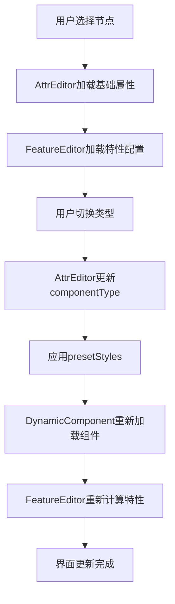

# 低代码平台节点类型选择实现机制

## 架构概览

系统采用**四层架构**实现节点类型选择，从配置定义到运行时渲染形成完整闭环。

## 核心组件架构

### 1. 配置层 - `blocks.config.json`
**职责**：组件注册与元数据管理

```json
{
  "type": "Button",
  "nameZh": "按钮",
  "path": "../blocks/Button.svelte",
  "showFeatureTab": true,
  "presetStyles": {
    "display": "flex",
    "justifyContent": "center",
    "alignItems": "center",
    "cursor": "pointer",
    "backgroundColor": "none"
  },
  "featureProps": {
    "enableClick": {
      "label": "点击事件",
      "type": "switch",
      "default": false
    }
  }
}
```

**关键字段**：
- `type`: 组件唯一标识符
- `nameZh`: 用户界面显示名称
- `path`: 组件文件路径（支持动态加载）
- `showFeatureTab`: 是否显示特性设置页签
- `presetStyles`: 组件预设样式（类型切换时自动应用）
- `featureProps`: 组件特有可配置属性
- `hideTextContent`: 是否隐藏文本内容

### 2. 动态加载层 - `DynamicComponent.svelte`
**职责**：运行时组件动态加载与渲染

**核心机制**：
```typescript
// 组件映射表生成
const componentMap: Record<string, () => Promise<{ default: Component }>> = {}

// 根据配置动态构建映射
for (const item of blocksConfig) {
  componentMap[item.type] = () => loadComponent(item.path)
}

// 运行时组件加载
$effect(() => {
  if (type && componentMap[type]) {
    componentMap[type]().then((module) => {
      TargetComponent = module.default
    })
  }
})
```

**关键特性**：
- **零配置扩展**：新增组件只需在配置文件中声明
- **稳定性保障**：组件类型切换时保持`data-id`不变
- **懒加载**：组件按需加载，提升性能

### 3. 属性编辑层 - `AttrEditor.svelte`
**职责**：节点基础属性管理与类型切换

**类型切换流程**：
1. **配置读取**：从`blocks.config.json`动态生成类型选项
2. **用户选择**：下拉框选择新组件类型
3. **属性更新**：
   - 更新节点`componentType`字段
   - 自动应用`presetStyles`预设样式
   - 触发`DynamicComponent`重新加载

**关键代码**：
```typescript
function handleTypeChange(newType: string) {
  if (!selectedId) return
  const finalType = newType || componentOptions[0]?.type || ''
  currentType = finalType
  
  // 更新组件类型
  updateNodeProperties(selectedId, { componentType: finalType })
  
  // 应用预设样式
  const blockMeta = blocksConfig.find(b => b.type === finalType)
  if (blockMeta?.presetStyles) {
    updateNodeProps(selectedId, { styles: { ...blockMeta.presetStyles } })
  }
}
```

### 4. 特性编辑层 - `FeatureEditor.svelte`
**职责**：组件特有属性动态配置

**动态特性渲染**：
```typescript
// 根据组件类型获取特性配置
const featureProps = () => {
  const node = getFullNode(selectedId)
  const type = node?.componentType || node?.attributes?.type
  return blocksConfig.find(c => c.type === type)?.featureProps
}

// 动态生成控件
{#each propEntries() as prop}
  {#if prop.type === 'select'}
    <PropertySelect ... />
  {:else if prop.type === 'switch'}
    <ToggleSwitch ... />
  {:else if prop.type === 'image'}
    <ImageUploader ... />
  {/if}
{/each}
```

## 数据流与生命周期

### 完整工作流程



### 状态同步机制
- **单向数据流**：配置 → 编辑器 → 渲染器
- **响应式更新**：Svelte 5响应式系统自动处理状态同步
- **稳定性保障**：组件标识符（data-id）在类型切换时保持不变

## 组件类型对比

| 组件类型 | 基础属性 | 特性设置 | 预设样式 | 使用场景 |
|---------|----------|----------|----------|----------|
| **SimpleBox** | 宽高、定位 | 无 | 无 | 通用容器 |
| **RealTimeClock** | 宽高、定位 | 7种时间显示模式 | 无 | 实时时间显示 |
| **Button** | 宽高、定位 | 点击事件、悬浮效果、图片高亮 | flex居中、指针光标 | 交互按钮 |
| **ButtonGroup** | 宽高、定位 | 无 | 无 | 按钮组合容器 |

## 扩展性设计

### 新增组件步骤
1. **创建组件文件**：在`blocks/`目录下创建新组件
2. **配置注册**：在`blocks.config.json`中添加配置
3. **特性定义**（可选）：添加`featureProps`配置
4. **预设样式**（可选）：添加`presetStyles`配置

### 技术亮点
- **零代码集成**：无需修改核心逻辑即可添加新组件
- **类型安全**：TypeScript确保配置和代码的一致性
- **渐进增强**：从简单到复杂逐步添加特性
- **用户体验**：类型切换无状态丢失，操作流畅

## 最佳实践

### 组件开发规范
1. **统一接口**：所有组件必须接受标准props接口
2. **样式隔离**：使用CSS作用域避免样式冲突
3. **响应式设计**：支持百分比和自适应布局
4. **性能优化**：合理使用懒加载和缓存

### 配置管理建议
1. **版本控制**：配置文件纳入版本管理
2. **文档同步**：保持配置与实际组件同步更新
3. **测试覆盖**：为每个组件类型添加测试用例
4. **用户反馈**：收集用户对新组件的需求和反馈